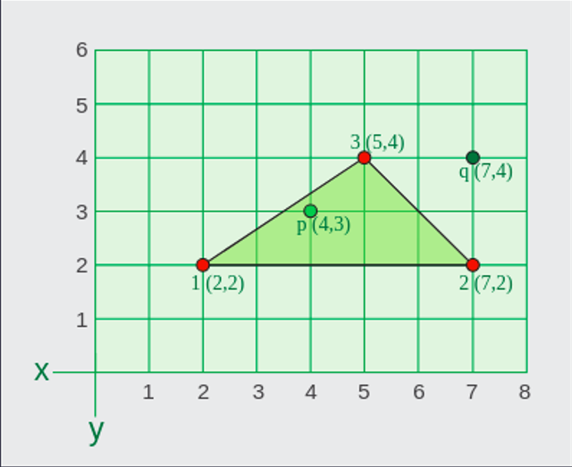
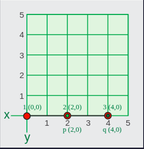
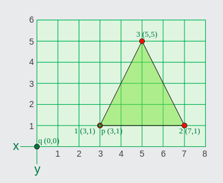
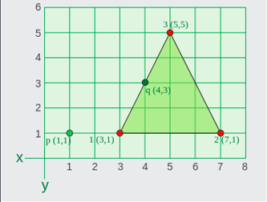
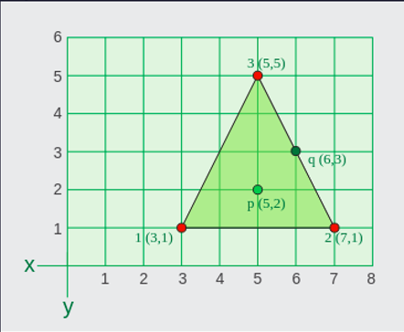
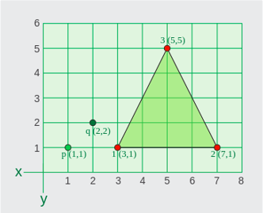

## Do they Belong?

A triangle formed by the three points a(x1,y1), b(x2,y2), and c(x3,y3) is anon-degenerate triangle if the following rules are respected(*|ab|* is the length of the line between points *a* and *b*):
- |ab| + |bc| > |ac|
- |bc| + |ac| > |ab|
- |ab| + |ac| > |bc|

A point *belongs* to a triangle if it lies somewhere on or inside the triangle. Given two points *p=(xp,yp)* and *q=(xq,yq)*, return the correct scenario number:
- 0: if the triangle abc does not form a valid non-degenerate triangle.
- 1: if point *p* belongs to the triangle but point *q* does not.
- 2: if point *q* belongs to the triangle but point *p* does not.
- 3: if both points *p* and *q* belong to the triangle.
- 4: if neither point *p* nor point *q* belong to the triangle.

#### Example
```
1 = a(x1,y1) : (2,2)
2 = b(x2,y2) : (7,2)
3 = c(x3,y3) : (5,4)
p = p(xp,xp) : (4,3)
q = q(xq,yq) : (7,4)
```


First, the triangle abc forms a valid non-degenerate triangle

- |ab| = 7 - 2 = 5.|bc| = sqrt((7-5)^2 + (4-2)^2) = sqrt (2^2 + 2^2) = sqrt(8) = 2.82. |ac| = sqrt((5-2)^2 + (4-2)2) = (3^2 + 2^2) = sqrt(13) = 3.6
- |ab| + |bc| > |ac| => 5 + 2.82 > 3.6
- |bc| + |ac| > |ab| => 2.82 + 3.6 > 5
- |ab| + |ac| > |bc| => 5 + 3.6 > 2.82

Second, the point p(5,4) belong to the triangle abc and the point q(7,4) does not as shown in the graphic above. So, the answer is 1.

### Function Description
Complete the function *pointsBelong* in the editor below.

*pointsBelong* has the following parameter(s):

- *int x1, y1, x2, y2, x3, y3*: integer coordinates of the three points that may create a valid triangle:
- *int xp, yp, xq, yq*: integer coordinates of the two points *p* and *q*
- *Returns*: 
  - *int*: an integer value that represents the scenario

### Integer format for custom testing
Input from stdin will be processed as follows and passed to the function.

Each of the following values is an integer on its own line in the order given: *x1, y1, x2, y2, x3, y3, xp, yp, xq, yq*.

#### Sample case 0
##### Sample input 0
```
STDIN         FUNCTION
_____         _________
0        ->   (x1,y1) = (0,0)
0
2       ->    (x2,y2) = (2,0)
0
4       ->    (x3,y3) = (4,0)
0
2       ->    p = (xp,yp) = (2,0)
0
4       ->    q = (xq,yq) = (4,0)
0
```
##### Sample output 0
```
0
```
##### Explanation 0


First, the lines do not form a valid non-degenerate triangle: the three points a, b, c, lie on the same line, so it is impossible to form a triangle. The answer is 0.

#### Sample case 1
##### Sample input 1
```
STDIN         FUNCTION
_____         _________
3        ->   (x1,y1) = (3,1)
1
7       ->    (x2,y2) = (7,1)
1
5       ->    (x3,y3) = (5,5)
5
3       ->    p = (xp,yp) = (3,1)
1
0       ->    q = (xq,yq) = (0,0)
0
```
##### Sample output 1
```
1
```
##### Explanation 1


First, the lines form a valid non-degenerate triangle, where *a(3,1)*, *b(7,1)*, and *c(5,5)*,
- |ab| = 7 - 3 = 4. |bc| = sqrt(4^2 + 2^2) = sqrt(20) = 4.47. |ac| = sqrt(2^2 + 4^2) = sqrt(20) = 4.47.
- |ab| + |bc| > |ac| => 4 + 4.47 > 4.47
- |bc| + |ac| > |ab| => 4.47 + 4.47 > 4
- |ab| + |ac| > |bc| => 4 + 4.47 > 4.47

Second, the point *p(3,1)* belongs to the triangle abc and the point *q(0,0)* does not. So, the answer is 1.

#### Sample case 2
##### Sample input 2
```
STDIN         FUNCTION
_____         _________
3        ->   (x1,y1) = (3,1)
1
7       ->    (x2,y2) = (7,1)
1
5       ->    (x3,y3) = (5,5)
5
1       ->    p = (xp,yp) = (1,1)
1
4       ->    q = (xq,yq) = (4,3)
3
```
##### Sample output 2
```
2
```
##### Explanation 2


First, the lines form a valid non-degenerate triangle, where *a(3,1)*, *b(7,1)*, and *c(5,5)*,

Second, the point *q(4,3)* belongs to the triangle but the point *p(1,1)* does not. So, the answer is 2.

#### Sample case 3
##### Sample input 3
```
STDIN         FUNCTION
_____         _________
3        ->   (x1,y1) = (3,1)
1
7       ->    (x2,y2) = (7,1)
1
5       ->    (x3,y3) = (5,5)
5
5       ->    p = (xp,yp) = (5,2)
2
6       ->    q = (xq,yq) = (6,3)
3
```
##### Sample output 3
```
3
```
##### Explanation 3


First, the lines form a valid non-degenerate triangle, where *a(3,1)*, *b(7,1)*, and *c(5,5)*,

Second, both the points *p(5,2)* and *q(6,3)* belong to the triangle. So, the answer is 3.

#### Sample case 4
##### Sample input 4
```
STDIN         FUNCTION
_____         _________
3        ->   (x1,y1) = (3,1)
1
7       ->    (x2,y2) = (7,1)
1
5       ->    (x3,y3) = (5,5)
5
1       ->    p = (xp,yp) = (1,1)
1
2       ->    q = (xq,yq) = (2,2)
2
```
##### Sample output 4
```
4
```
##### Explanation 4


First, the lines form a valid non-degenerate triangle, where *a(3,1)*, *b(7,1)*, and *c(5,5)*,

Second, neither the point *p(1,1)* nor the point *q(2,2)* belong to the triangle. So, the answer is 4.